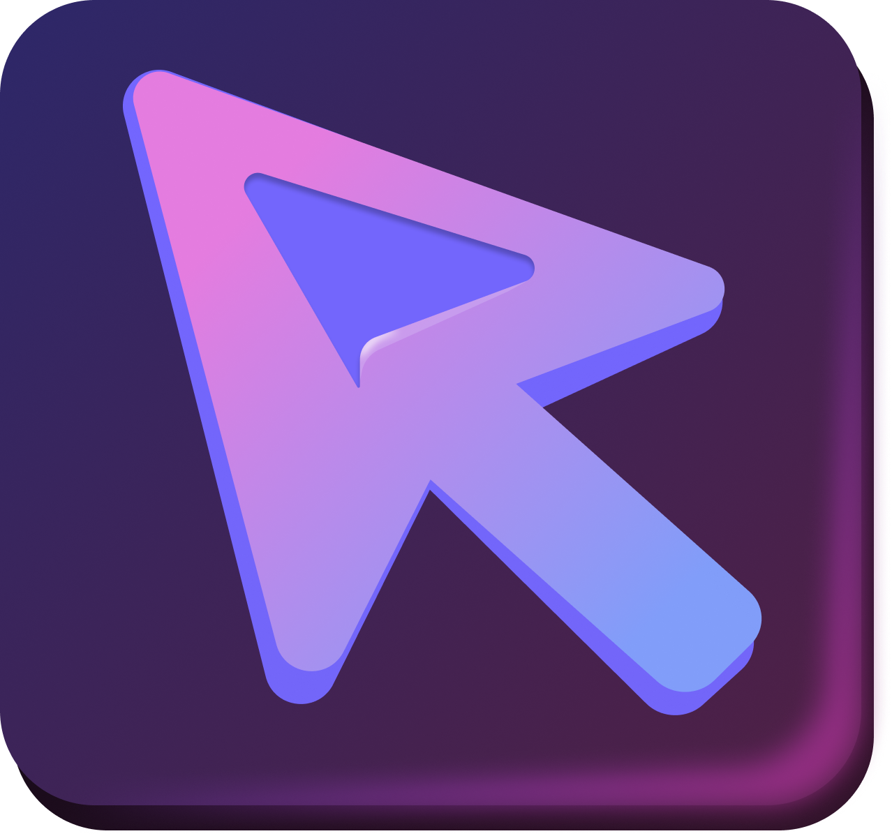

<div align="center">
    <span>
        
        
    </span>
</div>

# Rein

A cross-platform, low-latency remote control based on the **KISS principle**. Turn your phone into a wireless trackpad, keyboard, and WebRTC-powered screen mirror for your computer.

## Tech Stack

- **Framework**: [Vite](https://vitejs.dev/) + [TanStack Router](https://tanstack.com/router)
- **Real-time**: Native WebRTC (Peer-to-Peer) & WebSockets
- **Native Input**: [Koffi FFI](https://koffi.dev/) (C++ integration for Win/Linux/macOS)

## Setup

### 1. Build & Install

```bash
git clone https://github.com/Rozerxshashank/reinimprovevd.git
cd reinimprovevd
npm install
npm run dev
```

### 2. Platform-Specific Setup

#### Windows
No extra configuration required.

#### Linux (X11 & Wayland)
1. Add yourself to the input group:
   ```bash
   sudo usermod -aG input $USER
   ```
2. Set up uinput permissions:
   ```bash
   echo 'KERNEL=="uinput", GROUP="input", MODE="0660"' | sudo tee /etc/udev/rules.d/99-uinput.rules
   sudo udevadm control --reload-rules && sudo udevadm trigger
   sudo modprobe uinput
   ```
3. **Log out and log back in.**

#### macOS
Grant **Accessibility** permission to your terminal/IDE in **System Settings → Privacy & Security → Accessibility**.

## Connecting Different Devices

### Same Network (WiFi)
1. Open `http://localhost:3000` on your PC.
2. Scan the QR code with your phone.

### Different Networks / Restrictive WiFi (Tailscale)
If you are on a restricted network (like a University or Office) where devices can't "see" each other, use **Tailscale**:

1. Install [Tailscale](https://tailscale.com/download) on your PC and Phone.
2. Log in on both devices.
3. Open the app on your PC.
4. On your phone, enter the **Tailscale IP** of your PC (e.g., `100.x.x.x:3000`) in the browser.

## How to Use

1. **Start Server**: Run `npm run dev` on your computer.
2. **Connect Phone**: Use the QR code or URL.
3. **Mirror Screen**: Click **"Start Screen Mirror"** on your PC and select your screen.
4. **Control**: Use your phone screen as a trackpad. Toggle the **Keyboard** icon to type.

## Troubleshooting

| Issue | Solution |
|---|---|
| **"Negotiating..." stuck** | Ensure both devices are on the same Tailscale or WiFi network. |
| **Input not working (Linux)** | Verify `ls -l /dev/uinput` shows `input` group ownership. |
| **Mirror black screen** | Ensure "Screen Recording" permission is granted to your browser. |

Visit the [Discord Channel](https://discord.com/invite/C8wHmwtczs) for support!  
(Go to Project -> Rein)

---
> Contributions are welcome! Please leave a star ⭐ to show your support.
